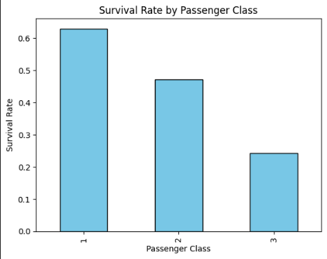

# AI & ML Internship - Task 2: Data Analysis and Visualization Tasks

This project demonstrates a step-by-step approach to data analysis and visualization using the Titanic dataset (or a similar dataset). The goal was to explore and understand the dataset, identify patterns, and generate insights through various statistical and visualization techniques. Below is a summary of the tasks performed, with visual references included.

---

## 1. Histograms
Histograms were created for all numeric features to visualize their frequency distributions. This helped identify their spread, skewness, and concentration.

---

## 2. Boxplots
Boxplots were plotted for numeric features to detect outliers and understand data variability:
- **Boxplot 1:** First subset of numeric features.
  
- **Boxplot 2:** Second subset of numeric features.
  
- **Boxplot 3:** Third subset of numeric features.
  

---

## 3. Pairplot
A pairplot was generated to visualize scatterplots and distributions between numeric features. This allowed for an exploration of feature relationships and potential clusters.

---

## 4. Correlation Matrix
A correlation matrix heatmap was created to evaluate the linear relationships between numeric features. Features with strong positive or negative correlations were identified.

---

## 5. Survival Rate by Passenger Class
A bar plot was created to analyze survival rates across different passenger classes. This revealed patterns in survival likelihood based on socioeconomic status.

---

## 6. Age vs Fare
A scatter plot of age vs. fare was created, with survival status indicated by color. This visualization highlighted the relationship between age, ticket fare, and survival probability.

---

## Tools Used
The following Python libraries were used for analysis and visualization:
- **Pandas**: For data manipulation and descriptive statistics.
- **Matplotlib**: For creating static visualizations like histograms and bar plots.
- **Seaborn**: For enhanced visualizations like boxplots, pairplots, and heatmaps.
- **Plotly**: For interactive visualizations like scatter plots.

